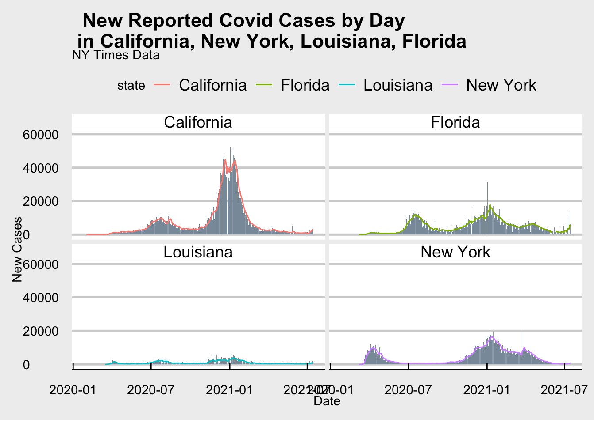
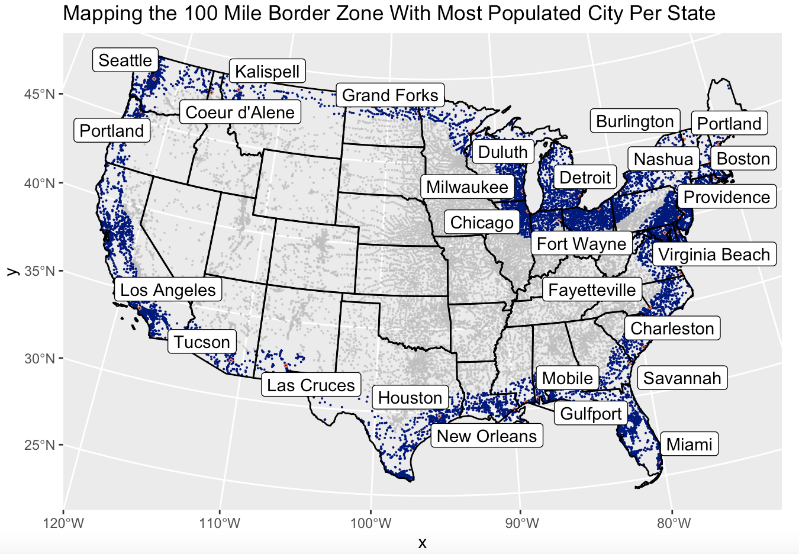
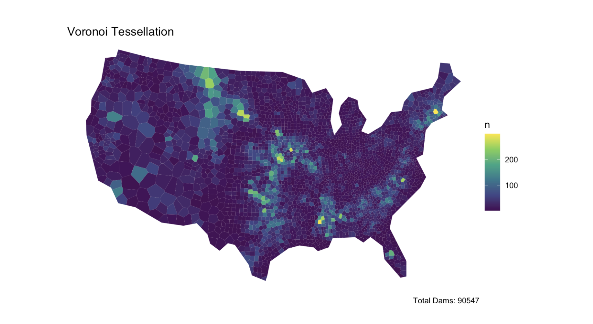

Here are links to all of the projects I completed this summer (2021) in my GIS class. This course was based in R, a programming language entirely new to me. I hope as you navigate through the links below you will be able to see my how skills develop over the course of this class.

#### [1. Building a project website](index.html)

{width=800px}

- This week I explored the foundations of a website, specifically that a .yml file is required for any website and acts as the map of the site.

- I was able to teach myself how to adjust the dimensions of an image, which I know will come in handy as I am always trying to make my projects more artistic. 

- I feel more comfortable creating new projects and directories using the terminal.

- Pushing and committing my work is becoming easier, I enjoy frequently checking my knit html to see how my work is progressing!

#### [2. Creating Tables and Faceted Plots based on NY Times COVID-19 Data](lab-02.html)

{width=800px}

- This week's lab focused on visualizing COVID-19 data into tables and faceted plots.

- I became more familiar with using knitr to design tables and using different dplyr verbs to manipulate the data.

- I learned how to join data sets and create visually pleasing plots using ggplot(). 

#### [3. Distances and the Border Zone](lab-03.html)

{width=800px}

- This weeks lab involved the 100 mile border zone around the Continental US and working with simple features

- I calculated distances between US cities to their state border and to the national border

- I utilized gghighlight to show cities that are eqidistant from the Mexican and Canadian border

- I mapped the 100 mile border zone and labeled the most populus city in each state within the 100 mile Danger Zone

#### [4. Tesselations and Point-in-Polygon Analysis](lab-04.html)

{width=800px}

- This week I explored various tesselations and gridded coverages of spatial areas

- I learned about the Modifiable Areal Unit Problem(MAUP) and how different areal units can impact the results of spatial data analysis

- I chose a Voronoi tesselation to model the number of fire protection, flood control, fish and wildlife, and hydroelectric dams in the continental United States 

