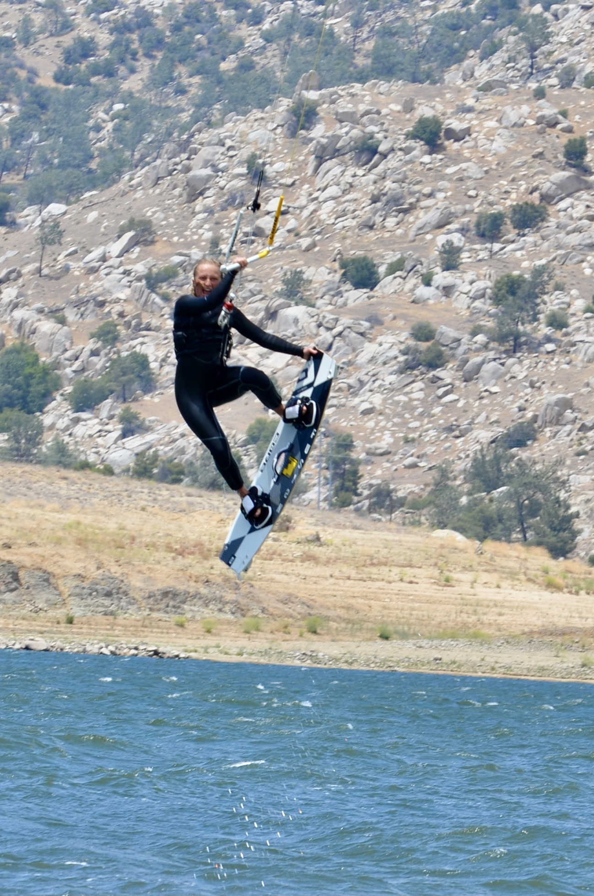

# Hello I'm Abby Vandenberg, welcome to my site!

 

{width=300px}    {width=300px}       {width=300px}

I am entering my final year at UCSB this fall. My love for the ocean led me to UCSB and the Physical Geography and Ocean Science program. As I develop my professional portfolio I am constantly seeking ways to include my passions for kiteboarding and entrepreneurship in my future career. I am pursuing an additional Technology Management Program Certificate from UCSB and I am excited to see how I can fruitfully combine these subject areas in my post graduation endeavors. 

During this past year I discovered kiteboarding and foiling. These water sports have taken over my life in the best way and led me to places like Mexico and Oregon to chase wind. I am hopeful to begin foil racing over the next few months and seeing where else this sport will bring me. 

Thank you for visiting my website, I hope you enjoy the projects I created as much as I am enjoying making them! Additionally, please visit my github account, which is linked to the icon in the top right.

#### Contact Me: alvandenberg@ucsb.edu

